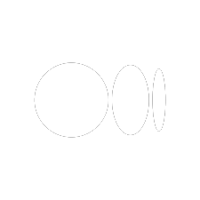

# Hi there, I'm Muhammed Shibil M 👋

I'm a Full Stack Developer with expertise in Django and currently learning Flutter. Here's a bit more about me:

- 🌱 I'm currently learning Flutter.
- 💼 Full Stack Developer with Django.
- 📫 You can reach me at [muhammedshibilm321@gmail.com](mailto:muhammedshibilm321@gmail.com).
- 😄 Pronouns: He/Him.

### Connect with Me:

 
 
 

## GitHub Stats

  
  
  

### About Me:

I'm passionate about 👨‍💻 coding and building awesome web and mobile applications. Feel free to explore my repositories and reach out if you have any questions or collaborations in mind!

### Technologies I Work With

                    

                    

